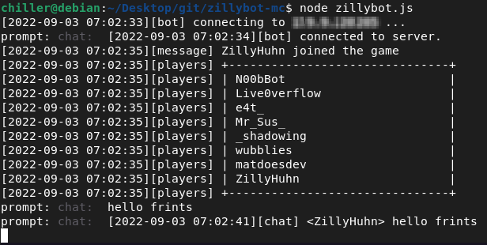

# zillybot-mc

yet another crappy headless minecraft bot

Nothing to see here. The cool library that makes it all happen is https://github.com/PrismarineJS/mineflayer

## getting started

    cp env.example .env
    vim .env
    npm install
    node zillybot.js

### private data (ignore this, its just for me)

    git clone git@github.com:ChillerDragon/zillybot-mc-data.git data
    cd data
    ./setup.sh

## goals of the project

Building a headless client that can be used as interactive terminal client and as bot.

### interactive client

- [x] chatting
- [ ] show inventory
- [ ] notify user about danger
    + [ ] alert/disconnect on damage
    + [ ] alert/disconnect on creeper nearby
    + [ ] alert/disconnect on player nearby

### bot client

- [x] stay on server (auto reconnect)
- [x] log everything to a file
    + [ ] parse the logfile or use a database to get stats
- [ ] chat commands about stats
    + [ ] !lastseen
    + [ ] !firstseen
    + [ ] !deaths
    + [ ] !kills
    + [x] !seed
    + [x] !checkhash
    + [ ] !mail
- [ ] bridge minecraft chat to irc

## features

- show playerlist on join
- interactive chat
- chat logfile

